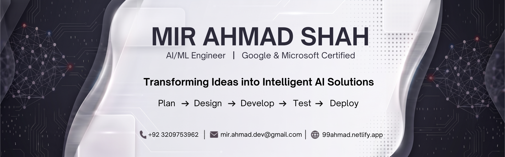

  

<h1 align="center">Hi 👋, I'm Mir Ahmad Shah</h1>

<h3 align="center">

</h3>

  

---

## 👨‍💻 About Me

- 🚀 **End-to-end Software Development:** PLAN → CODE → BUILD → TEST → DEPLOY
- 🤖 **Currently Learning:** Agentic AI, AI Automation & LLM Applications
- 🌐 **Portfolio:** https://99ahmad.netlify.app/
- 💬 **Ask Me About:** AI/ML, Python, Full-Stack Development, Web Development, and Open Source Collaboration
- 📫 **Email:** **mir.ahmad.dev@gmail.com**

---

# 🌐 Connect With Me

---

# 💻 Tech Stack

### Programming Languages

### Frontend

### Backend & Mobile

### Databases

### AI / Machine Learning

### Cloud & Tools

---

# 📊 GitHub Statistics

 
 

---

# 🐍 Contribution Snake

